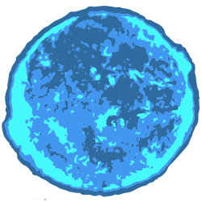

<p align="center">
  
</p>

<h1 align="center">Hypergiant</h1>

<p align="center">Hypergiant is a small and simple signal-like event emitter for Node.js and the browser.<p>

<div align="center">
  <a href="https://badge.fury.io/js/hypergiant"></a>
  <a href="https://badge.fury.io/js/hypergiant"></a>
  <a href="https://badge.fury.io/js/hypergiant"></a>
  <a href="https://badge.fury.io/js/hypergiant"></a>
</div>

## **Installation**

To download Hypergiant through NPM, simply use:

```
$ npm install --save hypergiant
```

and use it in your Node environment as so:

```js
const Hypergiant = require('hypergiant');
```

or import it browser side as an ES6 module:

```js
import Hypergiant from './node_modules/hypergiant/hypergiant.js';
```

## **Basic Usage**

Hypergiant is a signal-like event emitter for Node.JS and the browser.

Hypergiant is very minimal and fast but also very powerful. It is comparable to events in native JavaScript except
that Hypergiant events are emitted after the action has occurred and it doesn't rely on the events being referenced
by string which can lead to misspellings.

Creating a new signal is as simple as:

```js
const appStarted = new Hypergiant();
```

Any variable or property can be made into a signal.

Now a signal isn't very useful if there isn't a response to the event when it happens. To add a task that will run
whenever the event is dispatched, use the `add` method on the created signal:

```js
appStarted.add(hello);

function hello(name) {

  console.log(`Hello ${name}!`);

}
```

You can add as many methods as you would like to respond to a signal.

Lastly, it's time to dispatch the signal with the `dispatch` method:

```js
appStarted.dispatch('Bob');

// The console will display the following message:
// => Hello Bob!
```

Any parameters passed with `dispatch` will also be passed to the tesk functions attached to it.

## **API**

### **add**

Add takes in a function and an optional parameter named `once` that can be set to true if you would like this task to be called only once and then be deleted.

| param | type     | description                                                                                | default |
|-------|----------|--------------------------------------------------------------------------------------------|---------|
| fn    | Function | The function to be called when the signal is dispatched.                                   |         |
| once  | false    | Indicates whether this task should happen only once and then be automatically deleted.     | false   |

```js
const sol = new Hypergiant();

// When sol is dispatched, the `sayHello` function will be called once and then deleted from the signal's task list.
sol.add(sayHello, true);

function sayHello(name1, name2) {

  console.log(`Hello ${name1} and ${name2}!`);

}
```

### **dispatch**

Dispatch sends out the signal and any attached tasks will be called.

This method can take any number of parameters which will act as data sent to the tasks.

| param   | type    | description                                              | default |
|---------|---------|----------------------------------------------------------|---------|
| ...data | any     | Any data that you want to pass to the tasks              |         |

```js
const sol = new Hypergiant();

// When sol is dispatched, the `sayHello` function will be called once and then deleted from the signal's task list.
sol.add(sayHello, true);

function sayHello(name1, name2) {

  console.log(`Hello ${name1} and ${name2}!`);

}

// At some other point in your application...
// This will dispatch the Hypergiant event and any attached tasks will be called with 'Bob' and 'John' as parameter values.
sol.disaptch('Bob', 'John');

// In this case the `sayHello` function will log:
// => Hello Bob and John!
```


### **remove**

Deletes a task from the signal

| param | type     | description                                                                                | default |
|-------|----------|--------------------------------------------------------------------------------------------|---------|
| fn    | Function | The function to delete                                                                     |         |

```js
const sol = new Hypergiant();

sol.add(hello);

sol.remove(hello);

function hello() {

  return 'Hello World!';

}
```

### **removeAll**

Deletes all tasks from the signal.

```js
const sol = new Hypergiant();

sol.add(hello);

sol.removeAll();

function hello() {

  return 'Hello World!';

}
```

## **License**

MIT
