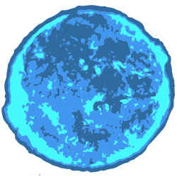

<p align="center">
  
</p>

<h1 align="center">Hypergiant</h1>

<p align="center">Hypergiant is a small and simple signal-like event emitter for Node.js and the browser.<p>

<div align="center">
  <a href="https://badge.fury.io/js/hypergiant"></a>
  <a href="https://badge.fury.io/js/hypergiant"></a>
  <a href="https://badge.fury.io/js/hypergiant"></a>
  <a href="https://badge.fury.io/js/hypergiant"></a>
</div>

## **Installation**

To download this module through npm, simply use the following command.

```
$ npm install --save hypergiant
```

To use Hypergiant in your Node.js project:

```js
const Hypergiant = require('hypergiant');
```

To import Hypergiant as an ES6 module:

```js
import { Hypergiant } from './node_modules/hypergiant/es6/hypergiant.js';
```

Lastly, to just reference Hypergiant by script:

```html
<script src="./node_modules/hypergiant/dist/hypergiant.min.js">
```

## **Basic Usage**

Hypergiant is a signal-like event emitter module named after hypergiant stars, which explains the star-like terminology. Visualizing how Hypergiant works is easier if you compare it to native JavaScript events. When you create a custom event in native JavaScript, you set a variable equal to a new custom event. In Hypergiant, you do the same thing but you don't put any data in the initialization like you would with a custom event.

Creating a new Hypergiant signal is as simple as:

```js
const sayHello = new Hypergiant();
```

You can set any type of variable or property (like a class property) to a new instance of Hypergiant and you can create as many Hypergiants as you would like.

Now there's probably no reason to create an event unless you want to listen for it to do something else. In native JavaScript events you would listen to the window event but that relies on a typed event which can be misspelled.

In Hypergiant it's a bit different, you have to assign one or more functions through the use of the `fuse` method of the Hypergiant and whenever the event is dispatched, the functions attached to the star will be called.

```js
sayHello.fuse(hello);

function hello(name) {

  console.log(`Hello ${name}!`);

}
```

In the above example, the Hypergiant created previously is set to fuse (call) the hello function when the event is dispatched. Notice that the hello function takes a parameter of name. This is because when you dispatch an event from the Hypergiant, you can return any amount of data to the function that is reacting to it.

Note that you can add as many functions as you would like to fuse with a Hypergiant.

Lastly, it's time to dispatch the Hypergiant event with the `react` method:

```js
messageSent.react('Bob');

// The console will display the following message:
// => Hello Bob!
```

Any parameters passed with `react` will also be passed to the fusion functions attached to it.

## **API**

### **fuse**

Fuse takes in a function and an optional parameter named `once` that can be set to true if you would like this fusion function to be called only once and then it gets deleted.

| param | type     | description                                                                                | default |
|-------|----------|--------------------------------------------------------------------------------------------|---------|
| fn    | Function | The function to be called when the Hypergiant reacts.                                      |         |
| once  | false    | Indicates whether this fusion should happen only once and then be automatically deleted.   | false   |

```js
const sol = new Hypergiant();

// When sol reacts, the `sayHello` function will be called once and then deleted from the Hypergiant's fusions set.
sol.fuse(sayHello, true);

function sayHello(name1, name2) {

  console.log(`Hello ${name1} and ${name2}!`);

}
```

### **react**

React dispatches the Hypergiant event and any attached fusion functions will be called.

This method can take any number of parameters which will act as data sent to the fusion functions.

| param   | type | description                                              | default |
|---------|------|----------------------------------------------------------|---------|
| ...data | *    | Any data that you want to pass to the fusion functions   |         |

```js
const sol = new Hypergiant();

// When sol reacts, the `sayHello` function will be called once and then deleted from the Hypergiant's fusions set.
sol.fuse(sayHello, true);

function sayHello(name1, name2) {

  console.log(`Hello ${name1} and ${name2}!`);

}

// At some other point in your application...
// This will dispatch the Hypergiant event and any attached fusion functions will be called with 'Bob' and 'John' as parameter values.
sol.react('Bob', 'John');

// In this case the `sayHello` function will log:
// => Hello Bob and John!
```

## **License**

MIT